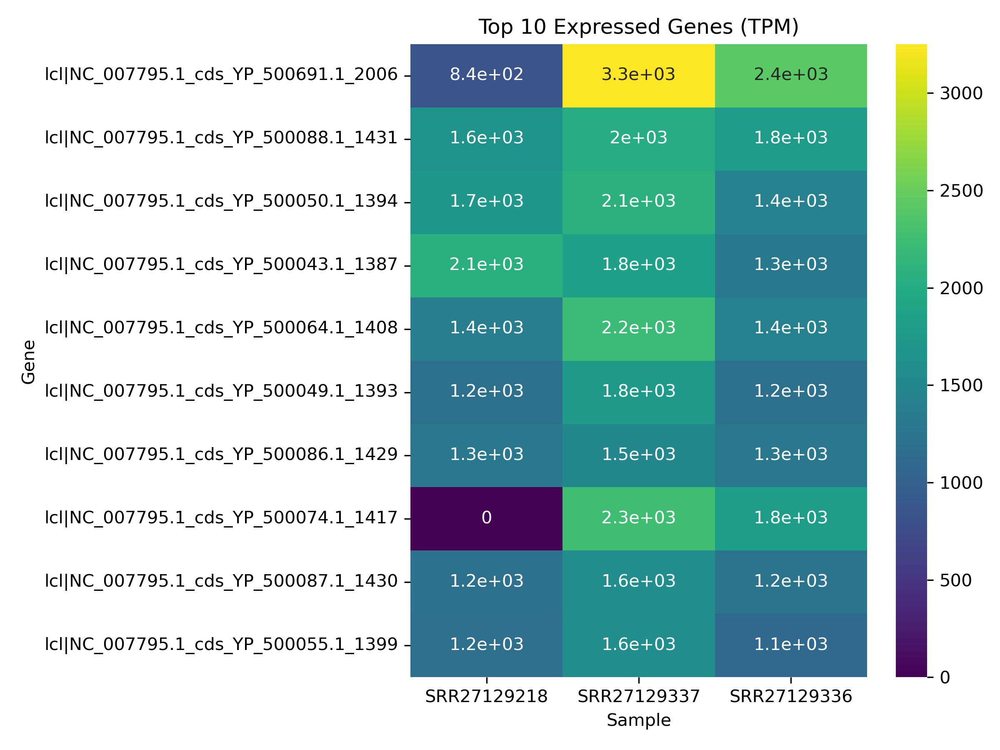

# Group Project: RNA-Seq Workflow (Microbial)

## Preparation
- **GitHub Setup**
  - Team members: Caitlin Corcoran, Amanda Kemper, Nicholas Lawson, Dechao Zhu

## Data Retrieval
- **NCBI SRA accessions used:**
  - SRR27129218_1
  - SRR27129218_2
  - SRR27129336_1
  - SRR27129336_2
  - SRR27129337_1
  - SRR27129337_2

- **Commands used to download data:**
  ```bash
  wget -nc ftp://ftp.sra.ebi.ac.uk/vol1/fastq/SRR271/018/SRR27129218/SRR27129218_2.fastq.gz
  wget -nc ftp://ftp.sra.ebi.ac.uk/vol1/fastq/SRR271/018/SRR27129218/SRR27129218_1.fastq.gz
  wget -nc ftp://ftp.sra.ebi.ac.uk/vol1/fastq/SRR271/036/SRR27129218/SRR27129336_2.fastq.gz
  wget -nc ftp://ftp.sra.ebi.ac.uk/vol1/fastq/SRR271/036/SRR27129218/SRR27129336_1.fastq.gz
  wget -nc ftp://ftp.sra.ebi.ac.uk/vol1/fastq/SRR271/037/SRR27129337/SRR27129337_2.fastq.gz
  wget -nc ftp://ftp.sra.ebi.ac.uk/vol1/fastq/SRR271/037/SRR27129337/SRR27129337_1.fastq.gz

## Quality Control (QC)
- **Tools Used:** 
  - FastQC
  - MultiQC
- **Tasks Performed:**  
  - Generated per-sample QC reports  
  - Summarized read quality, GC content, adapter contamination, duplication  
- **Deliverables:**  
  -Example screenshots included in the `/plots/` directory:  
  - `basic_statistics.png`  
  - `per_base_quality.png`
  - `per_sequence_gc.png`

  -Raw Read Counts and Duplicates
| Sample        | Total Sequences | % Duplicates |
|---------------|-----------------|--------------|
| SRR27129218_1 | 3,858,381       | 62.91%       |
| SRR27129218_2 | 3,858,381       | 63.74%       |
| SRR27129336_1 | 6,012,165       | 52.12%       |
| SRR27129336_2 | 6,012,165       | 52.35%       |
| SRR27129337_1 | 6,723,158       | 49.32%       |
| SRR27129337_2 | 6,723,158       | 50.16%       | 
- **Interpretation:**  
  - Overall, the sequencing data show **good read quality and appropriate GC content**. Adapter contamination was negligible. Duplication levels are elevated but still within a range that allows downstream analysis. With these considerations, the datasets are suitable for further analysis.

## Read Cleaning
- **Tools Used:** 
  - Fastp v0.23.4
- **Tasks Performed:**  
  - Processed paired-end raw reads for adapter trimming, quality filtering, and minimum length enforcement.
  - Used Fastp to automatically handle pairing between forward and reverse reads.
  - Compared pre- and post-QC results to assess read retention, GC content, and sequence length distribution.
  - Reviewed Fastp HTML and JSON reports to evaluate trimming performance and overall sequence quality.
- **Deliverables:**  
  - Cleaned paired-end FASTQ files (*_clean_R1.fastq, *_clean_R2.fastq)
  - Quality control reports (fastp.html, fastp.json)
  - Pre- and post-QC summary metrics
- **Interpretation:**  
  - The read cleaning process showed that the sequencing data were already of high quality. Minimal changes were observed between pre- and post-QC results in read count, GC content, and length distribution. These results indicate that the raw reads required little correction and were suitable for downstream assembly and annotation steps.

## Alignment
- **Tools Used:** 
  - Salmon
  - Python
  - Matplotlib
  - Pandas
- **Tasks Performed:**  
  - Aligned paired end sequences
  - Created plots to display alignment metrics
- **Deliverables:**  
  - Example screenshots included in the `/plots/` directory:  
    - `percent_mapped.png`  
    - `total_reads_processed.png`
- **Interpretation:**  
  - Overall, the alignment was successful. Approximately 3.9M reads were processed for SRR27129218, 6.0M for SRR27129336, 6.7M for SRR27129337. Of the reads that were processed approximately 90%, 87%, and 85% were mapped respectively. A mapping percentage above 80% is considered to be good. 

## Annotation & Quantification

### Tools Used
- **Salmon** (mapping-based mode) for transcript quantification (TPM)
- **Python** (pandas, matplotlib, seaborn) for data processing and plotting
- **MultiQC** for summarizing QC metrics across samples

### Tasks Performed
- Quantified microbial RNA-seq reads for three samples (**SRR27129218**, **SRR27129337**, **SRR27129336**) with Salmon to obtain per-gene **TPM** values.
- Parsed each sample’s `quant.sf`, merged them into a combined table, and computed **average TPM** per gene.
- Ranked genes by average TPM and selected the **top 10** most highly expressed.
- Generated a **heatmap** comparing expression of these top genes across all samples.
- Ran **MultiQC** to confirm consistency of read counts, mapping, and other QC signals.

### Deliverables
- `plots/top10_genes_table.csv` — Top 10 genes with TPM per sample and average TPM  
- `plots/top10_heatmap.png` — Heatmap of top-gene expression across samples  

> Heatmap preview:  
> 

### Interpretation 
- A small set of genes that appears to be **consistently very highly expressed** across all three samples as most averages ~1.2k–2.2k TPM; one peak ~3.3k, suggesting they are core transcripts for the organism under these conditions.
- The **overall pattern is similar** between samples, indicating good technical consistency and reproducible biology.
- One gene (`…YP_500074.1_1417`) is **near zero in SRR27129218** but **high in the other two** samples—an outlier worth verifying.
- Magnitudes differ slightly by sample (**SRR27129337** tends to be highest, **SRR27129336** slightly lower, **SRR27129218** lowest), but the **rank order** of highly expressed genes is largely preserved.
